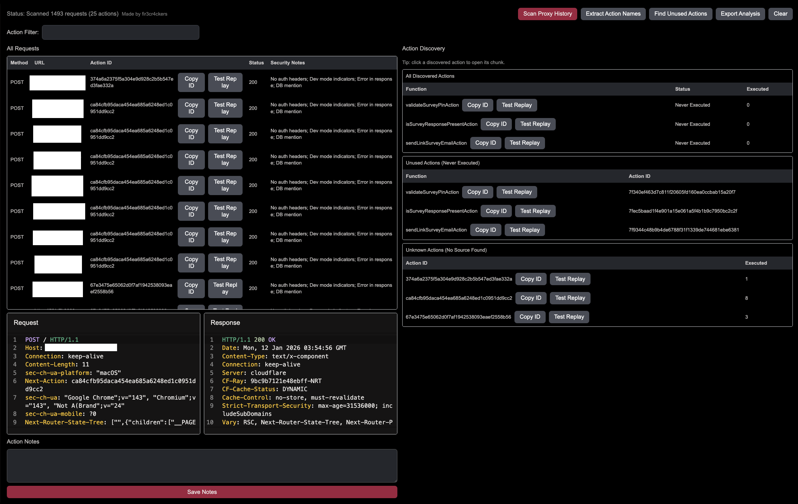

# Next.js Actions Analyzer (Caido plugin)

A Caido plugin that helps you discover, analyze, and export **Next.js Server Actions** observed in proxy traffic. inspired from [This Burp plugin](https://github.com/Adversis/NextjsServerActionAnalyzer).

It:
- Detects executed Server Actions via the `Next-Action` header
- Scans `/_next/static/chunks/*.js` responses to discover action ids + function names
- Highlights simple security signals (e.g. missing auth headers, suspicious parameter keys)
- Lets you open the associated chunk request, create a replay session, and export results




## Installation

### From a release

1. Download `plugin_package.zip` from the GitHub release.
2. Install it in Caido (Plugins → Install).

### From source (development)

Prereqs: Node.js 20, pnpm 9

```bash
pnpm install
pnpm watch
```

Then load the plugin in Caido using the Caido dev workflow.

## Usage

- Open **Next.js Actions Analyzer** from the sidebar.
- Click **Scan Proxy History** to extract executed actions from existing traffic.
- Click **Extract Action Names** to map action ids to function names by scanning Next.js chunk responses.
- Click **Find Unused Actions** to discover actions that exist in code but were never executed.
- Click **Export Analysis** to write a JSON export into Caido’s Files.

## Notes on detection

- Executed actions are identified via the `Next-Action` request header.
- Discovery works by scanning chunk JavaScript for `createServerReference(...)` patterns.

## License

MIT (see `LICENSE`).

## Author

Made by `fir3cr4ckers`.
